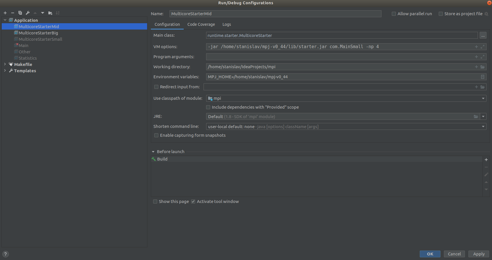

# mpi-word-frequency

1) Link ../mpj-v0_44/lib/mpi.jar library into the project.
2) Compile the source code.
3) Launch the application with the following command.

java −jar ../mpj-v0_44/lib/starter.jar com.Main −np 3

